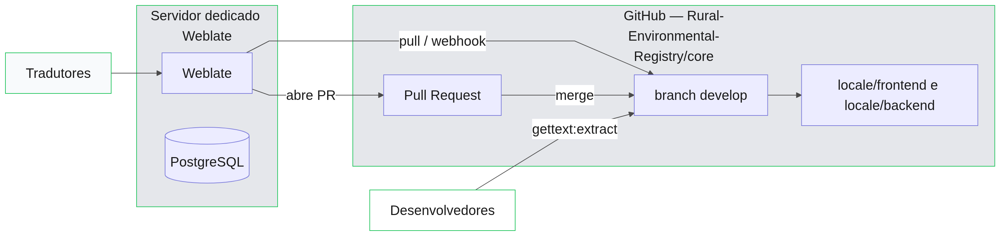
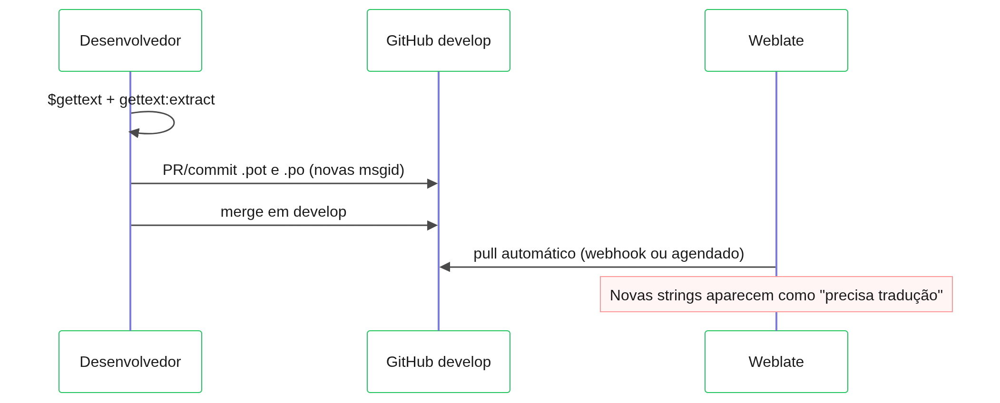
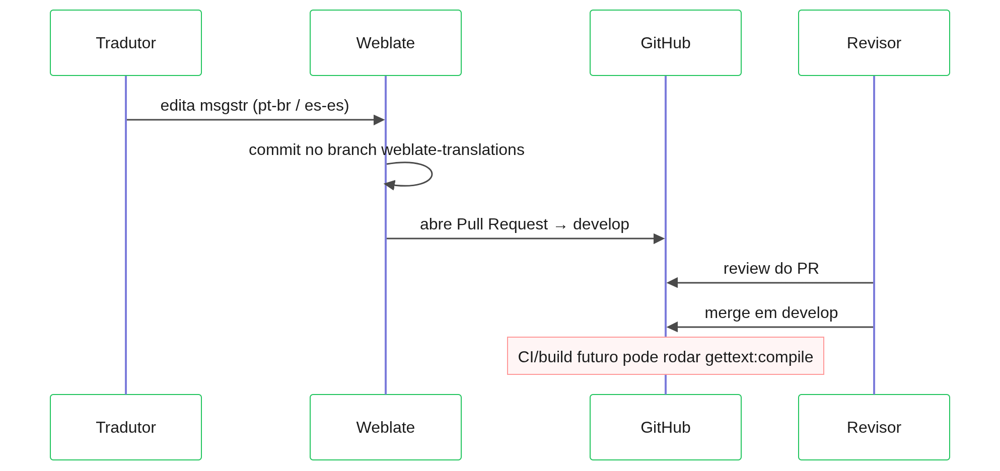

# Implantação do Weblate — RER-DPG

Este documento descreve como implantar o **Weblate** em **servidor dedicado** da organização, conectado ao repositório [Rural-Environmental-Registry/core](https://github.com/Rural-Environmental-Registry/core), com envio de traduções via **Pull Request** para a branch **`develop`**.

Para convenções de gettext, estrutura de `locale/` e papéis de desenvolvedor/tradutor, consulte [i18n-gettext.md](./i18n-gettext.md).

## Visão geral

O Weblate **não faz parte** do deploy da aplicação RER (Docker Compose, frontend, backend). É um serviço à parte que:

1. **Lê** do GitHub os arquivos `locale/**/*.po` e `*.pot` na branch `develop`.
2. Permite que tradutores editem apenas `msgstr` pela interface web.
3. **Abre Pull Requests** no GitHub quando há alterações prontas para integrar.

Arquivos **gerados** (`locale/frontend/translations.json`, `frontend/src/i18n/translations.json`, `reports/i18n/**/report_params.json`) **não** são editados no Weblate — são produzidos no build após o merge do PR.



## Pré-requisitos

### Repositório GitHub

| Item | Valor |
|------|--------|
| Organização / repo | `Rural-Environmental-Registry/core` |
| URL | `https://github.com/Rural-Environmental-Registry/core` |
| Branch de leitura | `develop` |
| Branch alvo do PR | `develop` |
| Pasta de traduções | `locale/` na raiz do monorepo |

### Conta de integração GitHub

Criar **uma** das opções (preferência: GitHub App):

1. **GitHub App** instalada no repositório `core`, com permissões de leitura/escrita em conteúdo e pull requests; ou
2. **Fine-grained personal access token** (conta de serviço/bot) com escopo apenas em `Rural-Environmental-Registry/core`.

Permissões necessárias:

- Leitura do repositório (clone/pull).
- Escrita em branches e abertura de Pull Requests.
- **Não** é necessário merge automático — revisão humana no GitHub.

Registrar credenciais apenas no servidor Weblate (variáveis de ambiente ou cofre da organização). Nunca commitar tokens no repositório.

## Instalação no servidor dedicado (Docker)

A instalação oficial recomendada é via [Docker Compose do Weblate](https://docs.weblate.org/en/latest/admin/install/docker.html). Exemplo de estrutura (adaptar paths e domínio):

```bash
# No servidor dedicado (exemplo)
sudo mkdir -p /opt/weblate
cd /opt/weblate
curl -LO https://raw.githubusercontent.com/WeblateOrg/docker-compose/master/docker-compose.yml
curl -LO https://raw.githubusercontent.com/WeblateOrg/docker-compose/master/environment
```

Editar `environment` (valores ilustrativos):

```bash
WEBLATE_SITE_DOMAIN=weblate.exemplo.gov.br
WEBLATE_ADMIN_PASSWORD=<senha-inicial-forte>
WEBLATE_SERVER_EMAIL=noreply@exemplo.gov.br
# PostgreSQL e Redis: usar defaults do compose ou externos gerenciados
```

Subir o stack:

```bash
docker compose up -d
```

Após o primeiro acesso (`https://weblate.exemplo.gov.br`), alterar a senha do usuário `admin`, configurar SMTP (notificações) e backup do volume PostgreSQL conforme política da organização.

## Configuração do projeto no Weblate

### 1. Criar o projeto

| Campo | Valor |
|-------|--------|
| Nome | `RER-DPG` |
| Slug | `rer-dpg` |
| Site web do projeto | `https://github.com/Rural-Environmental-Registry/core` |

### 2. Conectar o repositório Git

Em **Gerenciar → Repositório** (ou na criação do componente):

| Campo | Valor |
|-------|--------|
| Controle de versão | Git |
| URL do repositório | `https://github.com/Rural-Environmental-Registry/core.git` |
| Ramo | `develop` |
| Push branch | `weblate-translations` (ramo intermediário; ver seção PR abaixo) |
| Credencial | GitHub App ou token da conta de serviço |

**Importante:** o Weblate deve fazer push em um **branch dedicado** e abrir PR para `develop`, não fazer push direto em `develop`.

### 3. Habilitar Pull Requests no GitHub

Em **Gerenciar → Repositório → Configuração avançada** (ou addon **GitHub**):

- Ativar **Pull request** como método de envio.
- **Branch alvo do PR:** `develop`.
- **Título sugerido do PR:** `i18n: atualização de traduções via Weblate`.
- Atribuir revisores padrão (equipe de desenvolvimento), se a org usar code owners.

Fluxo resultante:

```
Weblate commit → branch weblate-translations → abre PR → develop
```

Alternativa sem branch permanente: usar o addon que cria um branch temporário por lote de traduções; o essencial é **sempre integrar via PR**, nunca push direto em `develop`.

### 4. Componentes de tradução

Criar **dois componentes** no projeto `RER-DPG`, ambos apontando para o mesmo repositório e branch `develop`:

#### Componente `frontend-ui`

| Campo | Valor |
|-------|--------|
| Nome | `frontend-ui` |
| Formato de arquivo | GNU gettext PO (monolingual) |
| Máscara de arquivos | `locale/frontend/*.po` |
| Arquivo de modelo | `locale/frontend/messages.pot` |
| Idioma base | `en` (código Weblate; corresponde a `en-us` no projeto) |
| Idiomas | `pt_BR`, `es` (mapear para `pt-br`, `es-es` nos nomes de arquivo) |

Arquivos versionados:

- `locale/frontend/en-us.po`
- `locale/frontend/pt-br.po`
- `locale/frontend/es-es.po`
- `locale/frontend/messages.pot` (somente leitura para tradutores; atualizado por desenvolvedores via `gettext:extract`)

#### Componente `backend-reports`

| Campo | Valor |
|-------|--------|
| Nome | `backend-reports` |
| Formato de arquivo | GNU gettext PO (monolingual) |
| Máscara de arquivos | `locale/backend/*.po` |
| Arquivo de modelo | `locale/backend/reports.pot` |
| Idioma base | `en` |
| Idiomas | `pt_BR`, `es` |

Arquivos versionados:

- `locale/backend/en-us.po`
- `locale/backend/pt-br.po`
- `locale/backend/es-es.po`

Para relatórios Jasper, tradutores editam `msgstr`; o `msgctxt` (ex.: `header.title_text`) **não deve ser alterado** — identifica a chave na estrutura JSON.

### 5. Sincronização com `locale/LINGUAS`

O arquivo [`locale/LINGUAS`](../../locale/LINGUAS) define os idiomas suportados:

```
en-us
pt-br
es-es
```

Manter os códigos de arquivo `.po` alinhados a essa lista. Ao adicionar idioma novo:

1. Atualizar `locale/LINGUAS` e código (ver [i18n-gettext.md](./i18n-gettext.md)).
2. Adicionar o idioma nos dois componentes Weblate.
3. Copiar do `.pot` correspondente o novo `{locale}.po`.

### 6. Arquivos que o Weblate não deve editar

Configurar **ignored** ou não incluir na máscara:

| Caminho | Motivo |
|---------|--------|
| `locale/frontend/translations.json` | Gerado por `npm run gettext:compile` |
| `frontend/src/i18n/translations.json` | Cópia de runtime do compile |
| `backend/src/main/resources/reports/i18n/**` | Gerado por `compile-backend-reports` / Gradle |
| `frontend/src/i18n/legacyKeyMap.ts` | Código-fonte; msgid vem do extract |

## Papéis e responsabilidades

### Desenvolvedores (repositório core)

1. Escrever strings em **inglês** no código (`$gettext('...')`).
2. Rodar `cd frontend && npm run gettext:extract` após mudanças de UI.
3. Commitar e fazer merge em `develop`: `.pot`, `.po` (novas entradas com `msgstr` vazio nas traduções).
4. Revisar e aprovar PRs abertos pelo Weblate.
5. Após merge do PR de tradução: validar localmente:

```bash
cd frontend && npm run gettext:compile && npm run build
node scripts/i18n/compile-backend-reports.mjs   # se alterou backend PO
```
### Tradutores (Weblate)

1. Acessar apenas a instância `https://weblate.<org>/projects/rer-dpg/`.
2. Editar **somente** `msgstr` em `pt-br` e `es-es` (e futuros idiomas).
3. Marcar tradução como revisada no Weblate, conforme workflow interno.
4. Deixar o Weblate **enviar** (criar PR); não clonar o repo para editar `.po` manualmente, salvo exceções acordadas.

### Revisores de PR (GitHub)

1. Verificar que o PR contém **apenas** alterações em `locale/**/*.po` (e eventualmente `messages.pot` / `reports.pot` se o Weblate sincronizou metadados).
2. Rejeitar PRs que alterem `translations.json` ou código-fonte.
3. Fazer merge em `develop` quando as traduções estiverem corretas.

## Fluxos de trabalho

### A — Nova string na aplicação (desenvolvedor)



### B — Tradução e integração (tradutor → PR)



### C — Conflito entre extract e Weblate

| Situação | Ação |
|----------|------|
| Dev alterou `.pot` e tradutor o mesmo `.po` | Prioridade: merge do dev em `develop` primeiro; Weblate refaz pull e pede retradução de entradas `fuzzy` |
| PR do Weblate com conflito em `.po` | Resolver no GitHub ou no Weblate (ferramenta de merge de traduções); não apagar `msgid` |
| String removida do código | `gettext:extract` marca obsoleta no `.po`; Weblate limpa na próxima sincronização |

## Configuração recomendada de PR no GitHub

### Branch protection em `develop`

- Exigir PR antes do merge.
- Exigir aprovação de pelo menos um revisor (code owners em `locale/` se aplicável).
- Permitir merge do bot/conta Weblate apenas via PR (sem bypass).

### Modelo de descrição do PR (Weblate)

Sugerir no addon ou instrução manual:

```markdown
## Traduções Weblate

Atualização automática de arquivos PO em `locale/frontend` e/ou `locale/backend`.

### Checklist do revisor
- [ ] Apenas arquivos `.po` (sem JSON gerado)
- [ ] `msgstr` coerente com `msgid` em inglês
- [ ] Sem alteração de `msgctxt` nos PO de relatório
- [ ] Após merge: `gettext:compile` no pipeline ou validação local
```
### Webhook (opcional)

Configurar no GitHub **Repository → Webhooks** apontando para o Weblate para pull imediato após merge em `develop`, reduzindo atraso até novas strings aparecerem para tradução.

## Pós-merge: validação no repositório

Após integrar PR de tradução em `develop`:

```bash
git checkout develop && git pull

# Frontend
cd frontend
npm ci
npm run gettext:compile
npm run build

# Backend (se houve mudança em locale/backend)
cd ..
node scripts/i18n/compile-backend-reports.mjs
cd backend && ./gradlew compileJava -x test
```
Confirmar na aplicação os idiomas `pt-br` e `es-es` (seletor de idioma / `localStorage` chave `language`).

## Segurança e conformidade

- Weblate em rede controlada; tradutores autenticados com contas individuais (sem usuário compartilhado).
- Token GitHub de menor privilégio possível, rotacionado periodicamente.
- Logs de auditoria do Weblate e do GitHub para rastrear quem alterou traduções.
- Dados nos `.po` são textos de interface e relatórios — classificar conforme política de informação da org; o servidor dedicado deve seguir o mesmo baseline de segurança dos demais serviços internos.

## Checklist de implantação

| # | Etapa | Responsável |
|---|--------|-------------|
| 1 | Provisionar servidor, DNS, TLS | Infra |
| 2 | Subir Weblate (Docker) + backup PostgreSQL | Infra |
| 3 | Criar GitHub App / token de serviço | DevOps |
| 4 | Criar projeto `RER-DPG` e componentes `frontend-ui` / `backend-reports` | i18n / Dev |
| 5 | Configurar PR para `develop` (sem push direto) | DevOps |
| 6 | Importar `locale/` a partir de `develop` | Dev |
| 7 | Cadastrar tradutores e permissões no Weblate | Gestão i18n |
| 8 | Documentar URL e fluxo para a equipe | Gestão i18n |
| 9 | Testar ciclo completo: edição → PR → merge → compile | Dev + tradutor |
| 10 | (Futuro) CI `i18n-compile` / checagem de `.pot` | Dev |

## Referências

- Repositório RER: [github.com/Rural-Environmental-Registry/core](https://github.com/Rural-Environmental-Registry/core)
- Gettext no projeto: [i18n-gettext.md](./i18n-gettext.md)
- Documentação Weblate: [docs.weblate.org](https://docs.weblate.org/)
- Instalação Docker: [Weblate Docker](https://docs.weblate.org/en/latest/admin/install/docker.html)
- Integração Git / GitHub: [Weblate VCS](https://docs.weblate.org/en/latest/admin/vcs.html)
